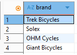
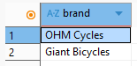
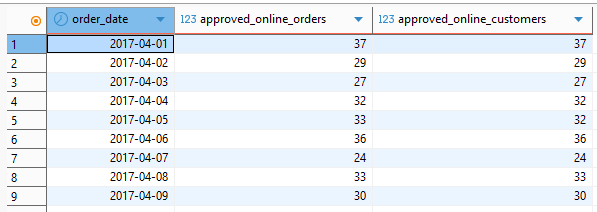
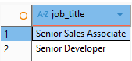
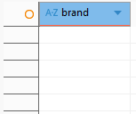
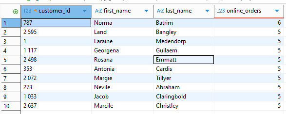
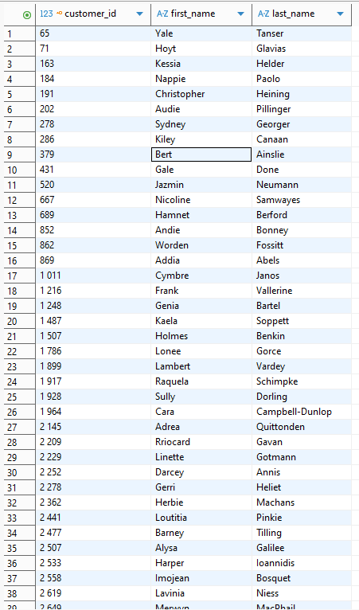
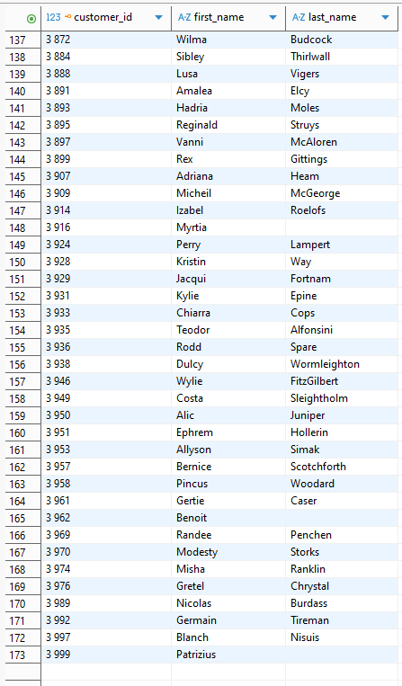
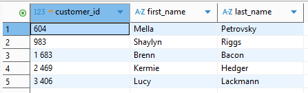
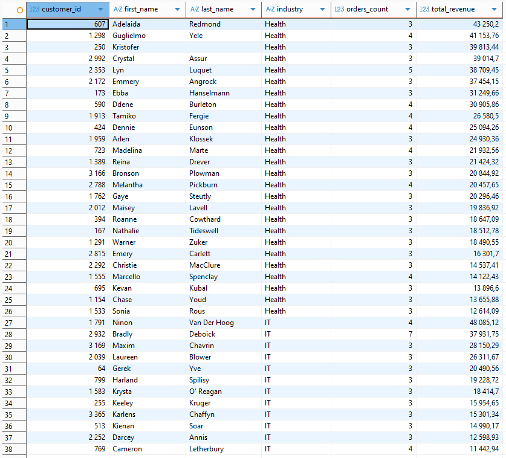

# 🌐 Основные операторы PostgreSQL - Домашнее задание №2


---

## 📌 Описание проекта

Работа состоит из двух частей:

1) создание структуры базы данных и проверка качества данных (Шаг 1)  
2) выполнение восьми SQL-запросов с анализом результатов (Шаг 2)

---

# 📁 Структура репозитория

```

DB2_homework/
│
├── data/
│   ├── customer.csv
│   ├── orders.csv
│   ├── order_items.csv
│   └── product.csv
│
├── sql/
│   ├── Вайс_Федор_STEP_1.sql
│   └── Вайс_Федор_STEP_2.sql
│
└── img/
    ├── ERD.png
    ├── T1_v1.png
    ├── T1_v2.png
    ├── T2.png
    ├── T3.png
    ├── T4.png
    ├── T5.png
    ├── T6_начало.png
    ├── T6_конец.png
    ├── T7.png
    └── T8.png

```

---

# 🧩 Шаг 1 - Создание структуры БД и подготовка данных

## 📍 ERD - итоговая схема данных


---

## 📍 Что было сделано

- созданы таблицы `customer`, `orders`, `order_items`, `product`
- выявлены дубликаты `product_id` в исходном `product.csv`
- создана новая таблица `products` с дедупликацией по `product_id`
- таблица `product` сохранена как "сырой" импорт
- выполнены проверки:
  - уникальность ключей
  - отсутствие NULL
  - корректность связей
  - отсутствие "висячих" ссылок
- обнаружены 3 заказа с отсутствующим клиентом (customer_id 5034)
  - сначала удалены связанные order_items
  - затем сами заказы
- восстановлены PK и FK после очистки


---

# 🥈 Шаг 2 - SQL-запросы (1-8)

Ниже приведены результаты каждого задания и важные нюансы, которые были учтены при выполнении.

---

# 🧪 Задача 1 - бренды с высокой себестоимостью и продажами

### 📝 Нюанс:
В задаче может быть двоякая трактовка: по брендам или по продуктам.  
Выбран вариант по брендам. Альтернативный вариант с группировкой по product_id также приложен в скриптах.  

  


---

# 🧪 Задача 2 - подтвержденные онлайн-заказы по дням

### 📝 Нюанс:
В результат нужно выводить `order_date`, иначе группировка теряет смысл.



---

# 🧪 Задача 3 - Senior в IT и Lead в Financial Services

### 📝 Нюанс:
Возраст считается через:
```sql
EXTRACT(YEAR FROM age(CURRENT_DATE, dob))
````

Это возраст "на сегодня".
Если бы требовался возраст на 2017 год, нужно:

```sql
EXTRACT(YEAR FROM age(DATE '2017-01-01', dob))
```



---

# 🧪 Задача 4 - бренды Financial Services, которых нет у IT

### 📝 Нюанс:

Использован `EXCEPT`, что корректно делает разность множеств.
ORDER BY применяется только к итоговому select.



---

# 🧪 Задача 5 - активные клиенты топ-брендов с valuation выше среднего

### 📝 Нюанс:

Среднее по штату считается по **всем клиентам**, а не только покупателям брендов.
Поэтому среднее вынесено в отдельное CTE.



---

# 🧪 Задача 6 - владельцы авто, не Mass Customer, без онлайн-заказов

### 📝 Нюанс:

"Последний год" трактуем как 2017 год, так как весь датасет ограничен 2017.
Если бы нужно было строго "max(order_date) минус год", использовался бы интервал.

### Начало результата:



### Конец результата:



---

# 🧪 Задача 7 - IT-клиенты, купившие ровно 2 из топ-5 Road-продуктов

### 📝 Нюанс:

Задание было сформулировано как "купили 2 из 5".
Мы трактуем это как **ровно 2 уникальных продукта**.
Если бы требовалось "не менее 2", условие было бы другим.



---

# 🧪 Задача 8 - клиенты IT и Health с высокой активностью и выручкой

### 📝 Нюанс:

Фильтрация только по Approved, онлайн-заказы не требуются.



---
## Содержание  
- [Описание проекта](#описание-проекта)  
- [Структура репозитория](#структура-репозитория)  
- [Шаг 1 - создание структуры БД](#шаг-1---создание-структуры-бд)  
- [Шаг 2 - SQL-запросы](#шаг-2---sql-запросы)  
  - [Задача 1](#задача-1)  
  - [Задача 2](#задача-2)  
  - ... и т. д.

